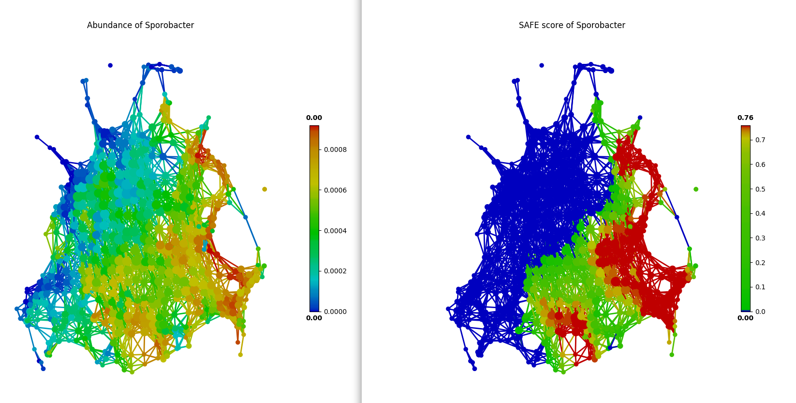
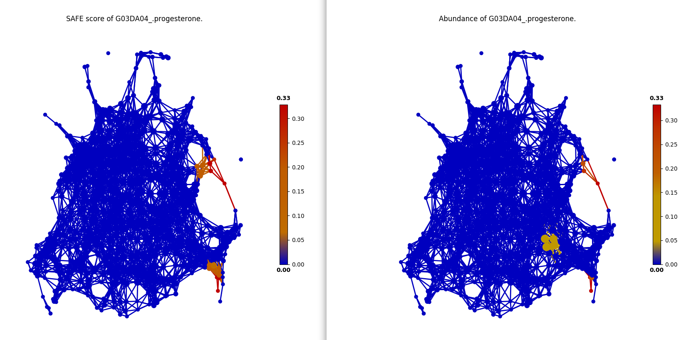
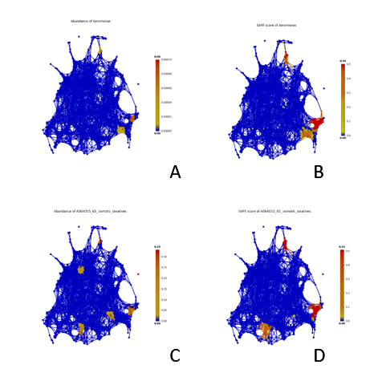
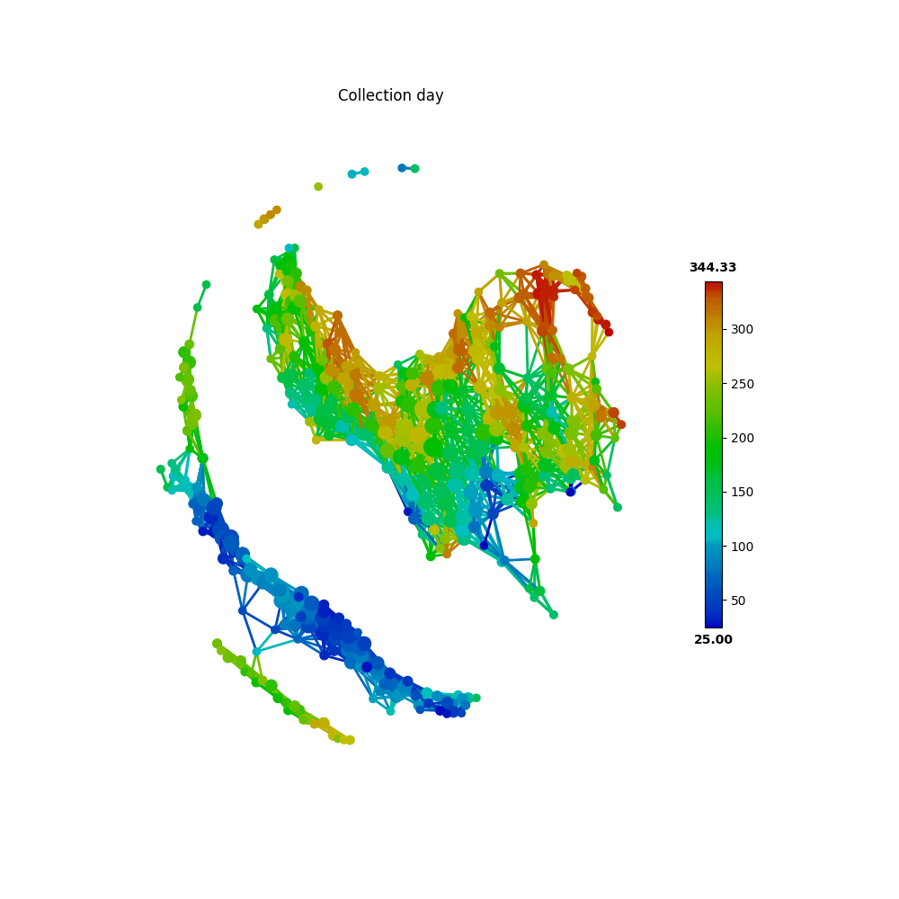
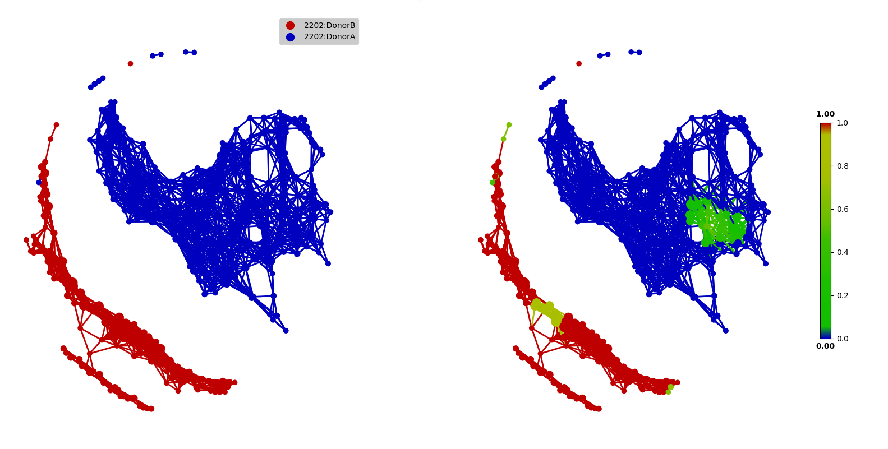

# Microbiome Examples

## Analyzing the population-scale FGFP microbiome dataset

To validate the performance of tmap, we benchmarked the result from Population-level analysis of gut microbiome variation (abbreviation as FGFP study below). [] Tmap was applied to re-analyze the driver genus of gut microbiota, significant microbiome covariates from metadata and the interaction among driver genera and covariates.

```python
from __future__ import print_function
from sklearn.preprocessing import MinMaxScaler
from sklearn.cluster import DBSCAN
from tmap.tda import mapper, filter
from tmap.tda.cover import Cover
from tmap.tda.plot import show, Color
from tmap.tda.metric import Metric
from tmap.tda.utils import optimize_dbscan_eps,cover_ratio
from tmap.netx.SAFE import SAFE_batch, get_SAFE_summary
from tmap.test import load_data
import os

# load taxa abundance data, sample metadata and precomputed distance matrix
X = load_data.FGFP_genus_profile()
metadata = load_data.FGFP_metadata()
dm = load_data.FGFP_BC_dist()

# TDA Step1. initiate a Mapper
tm = mapper.Mapper(verbose=1)

# TDA Step2. Projection
metric = Metric(metric="precomputed")
lens = [filter.MDS(components=[0, 1], metric=metric,random_state=100)]
projected_X = tm.filter(dm, lens=lens)

# Step4. Covering, clustering & mapping
eps = optimize_dbscan_eps(X, threshold=95)
clusterer = DBSCAN(eps=eps, min_samples=3)
cover = Cover(projected_data=MinMaxScaler().fit_transform(projected_X), resolution=50, overlap=0.75)
graph = tm.map(data=X, cover=cover, clusterer=clusterer)
print('Graph covers %.2f percentage of samples.' % cover_ratio(graph,X))

```

#### Driver species analysis

In FGFP study, the driver genus was identified by the contribution of each genus to microbiome variation via Canonical correspondence analysis (CCA) using both raw and normalized genus abundances. We identified driver genera by assessing and ranking the importance of a genus by the SAFE enriched score by tmap. This approach successfully recovered all top 10 driver genera previously reported in the FGFP study.

When comparing the result of driver genus identification with the one from FGFP study in detailed, we identify 7 out of top 10 driver genera repetitively. There were 3 driver genera failed to be identified by tmap, including *Prevotella, Alistipes and Blautia*.  The arbitrary cut-off for top 10 genera led to the failed identification as driver genera for all three species, since they were ranked with a relatively low SAFE enriched score. Moreover, for *Alitipes spp. and Blautia spp.*, the distribution of abundance on the network map was with a less steep gradient which mean discontinuous abundance compared with neighbors, also the nodes’ value of the peak was lower than those of top ranked genera, which caused the SAFE enriched score decreased and fell out of top 10 ranking.

Additionally, 3 genera were identified as driver genus novelly by tmap (*unclassified_Veillonellaceae, unclassified_Clostridiaceae and Sporobacter*).

It was intriguing to find *Sporobacter spp.* presented a **multiple-peaks of enrichment pattern** on the network map, which implied that non-linear correlation existed.



#### Identification of significant host covariates

In FGFP study, the covariates of microbiome variation were identified by calculating the association between host metadata factors and genus-level community ordination with envfit function in the vegan R package. The envfit function preforms manvoa and linear correlation for categorical and continuous variables, respectively. 69 out of 503 host factors were identified as covariates of gut microbiome when using FDR<0.1 as the criteria, 43 of them could be regarded as significant covariates when using FDR<0.05 as the cut-off.

Since tmap was robust to identify the both linear and non-linear associations, 67 out of 503 host factors were identified as significant covariates with FDR<0.05 as significance cut-off. More positive results were received than FGFP study. In summary, tmap successfully identified 41 out of 43 formerly detected metadata covariates, 26 novel covariates additionally.

For usage of *G03DA04_progesterone*, it can be easily found that, a minority subgroup of study population (red colored) were in use of the drug. The community size of this minority was too small to be regarded as a significant local enrichment across whole network map.  



The situation for concentration of *Gamma-glutamyltransferase* was different. The enrichment landscape of the factor did not show a clear pattern of enrichment, which meant that it could hardly to be detected any local enrichment pattern by tmap. The factor was likely to be non-relevant with the microbiota network structure in our implementation.


#### Microbiome-wide association of FGFP host covariates

In FGFP study, to conduct the association analysis between host covariates and driver species, the boosted additive generalized linear models were performed between the genus abundance matrix and previously defined 69 microbiome covariates, with 5% significance level (after adjustment for multiple comparison). However, it was reported to be a limited effect size for a covariate to explain the variation of genus abundance, the model could only explain 1.50% to 14.74% variation.

In our implementation, to investigate the interaction between metadata factors and the genus abundances, a co-enrichment of SAFE score was assessed, by calculating a paired-wise Pearson correlation between the genus abundance enriched TDA network map and the host factor enriched TDA network map. FDR<5% was used as the significance level.

By using co-enrichment of SAFE score, the effect size of host covariates was improved significantly, the effect size was from 11.5% to 72.8%. For example, the association between concentration of serum Hemoglobin and abundance of Roseburia spp., though was detected to be significantly associated by both FGPF study and tmap, the coefficient was improved from 0.12 to 0.72 by using tmap.    

Additionally, novel associations were identified. For example, the association between usage of A06AD15_65_.osmotic_laxatives and abundance of Aeromonas spp.



## Analysis human microbiome from daily timescales

More details about codes could review at `test/test_Daily_saliva.py` or `test/test_Daily_stool.py`.

Here we present stool samples data fist:

```python
from __future__ import print_function
from sklearn.preprocessing import MinMaxScaler
from sklearn.cluster import DBSCAN
from tmap.tda import mapper, filter
from tmap.tda.cover import Cover
from tmap.tda.plot import show, Color
from tmap.tda.metric import Metric
from tmap.tda.utils import optimize_dbscan_eps,cover_ratio
from tmap.netx.SAFE import SAFE_batch, get_SAFE_summary,SAFE_single
from tmap.test import load_data
from matplotlib.pyplot import title
from scipy.spatial.distance import pdist,squareform

# load taxa abundance data, sample metadata and precomputed distance matrix
X = load_data.Daily_genus_profile("stool")
X = X.drop("Stool69",axis=0)
metadata = load_data.Daily_metadata_ready()
dm = squareform(pdist(X,metric="braycurtis"))
metadata = metadata.loc[X.index,:]

# TDA Step1. initiate a Mapper
tm = mapper.Mapper(verbose=1)

# TDA Step2. Projection
metric = Metric(metric="precomputed")
lens = [filter.MDS(components=[0, 1], metric=metric,random_state=100)]
projected_X = tm.filter(dm, lens=lens)

# Step4. Covering, clustering & mapping
eps = optimize_dbscan_eps(X, threshold=99)
clusterer = DBSCAN(eps=eps, min_samples=3)
cover = Cover(projected_data=MinMaxScaler().fit_transform(projected_X), resolution=50, overlap=0.85)
graph = tm.map(data=X, cover=cover, clusterer=clusterer)
print('Graph covers %.2f percentage of samples.' % cover_ratio(graph,X))
```

```
Filtering by MDS.
...calculate distance matrix using the precomputed metric.
Finish filtering of points cloud data.
Mapping on data (501, 98) using lens (501, 2)
...minimal number of points in hypercube to do clustering: 3
...create 474 nodes.
...calculate projection coordinates of nodes.
...construct a TDA graph.
...create 3313 edges.
Finish TDA mapping
Graph covers 91.22 percentage of samples.
```

Taking collection day as target which passed to `Color` could help us to explore the pattern of microbiome on time scale.

```python
target_feature = 'COLLECTION_DAY'
color = Color(target=metadata.loc[:, target_feature], dtype="numerical", target_by="sample")
show(data=X, graph=graph, color=color, fig_size=(10, 10), node_size=15, mode='spring', strength=0.03)
```



We could see two distant clusters on the graph. For exploring the driver of the clustering, passing host information to `Color` for visualization could help us to find out the host distribution.

```python
target_feature = 'HOST_SUBJECT_ID'
color = Color(target=metadata.loc[:, target_feature], dtype="categorical", target_by="sample")
show(data=X, graph=graph, color=color, fig_size=(10, 10), node_size=15, mode='spring', strength=0.03)

color = Color(target=metadata.loc[:, target_feature], dtype="numerical", target_by="sample")
show(data=X, graph=graph, color=color, fig_size=(10, 10), node_size=15, mode='spring', strength=0.03)
```



Left is using categorical target to visualizing. And right is using numerical target to visualizing.

With this result, the major driver factor of the clustering is the difference of subjects. But the difference of subjects didn't report at the paper.

The paper majority compared single subject on daily time scale and report the skewness of microbiome. As paper said, Subject A left the United States on day 70 and returned on day 122. He suffered from diarrheal illnesses between days 80 and 85 and days 104 and 113. Subject B suffered from a enteric infection from days 151 to 159 of the study.

```python
def time_range(sample,start,end):
    target_vals = [1 if metadata.loc[_,"HOST_SUBJECT_ID"]=="2202:Donor%s" % sample and metadata.loc[_,"COLLECTION_DAY"] in list(range(start,end+1)) else 0 for _ in X.index]
    color = Color(target=target_vals, dtype="numerical", target_by="sample")
    show(data=X, graph=graph, color=color, fig_size=(10, 10), node_size=15, mode='spring', strength=0.03)
    title("Subject %s at %s to %s" % (sample,start,end))
# Travel period
time_range("A",70,123)
# First diarrheal illness
time_range("A",80,85)
# Second diarrheal illness
time_range("A",104,113)

# Pre-travel period
time_range("A",40,69)
# Travel period
time_range("A",70,122)
# Post-travel period
time_range("A",123,153)

# Pre-enteric infection period
time_range("B",121,150)
# enteric infection period
time_range("B",151,159)
# Post-enteric infection period
time_range("B",160,197)
```


From the above graphs, we could found that subject A experience several changes of microbiome between day 70 and day 122. Diarrheal illnesses at the different time also found some **shared similarity**. It also concluded that **Subject A’s travel-related microbiota shift** is consistent with the state switch model which is described in the original paper.

Subject B's microbiome shift before and after the enteric infection also distinct, doesn't show any short-term connections and it is also consistent with the model which is described at Fig.3 of the paper.

The tmap could also tell which genus is more correlated to each period with `coenrich` method. The original paper didn't report this correlation and so it doesn't report here.
