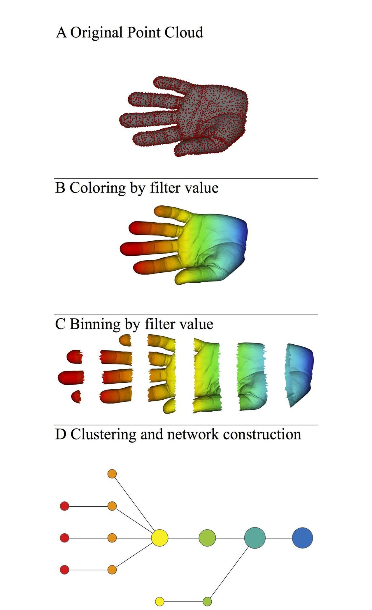
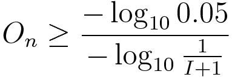

# How *tmap* work

**Topological data analysis** (**TDA**) is the application of topological analysis techniques to study datasets in high dimensional space, to capture topological properties of a dataset which are invariant to noise and scales. Currently, there are two common techniques of TDA: **persistent homology** and the ***Mapper*** algorithm. ***tmap*** is an implementation of the *Mapper* algorithm in Python, and is a TDA framework designed from microbiome data analysis. Because of the generality of the framework, *tmap* can also be used to analyze high dimensional datasets other than microbiome.

Compared with other *Mapper* software, *tmap* was designed with the following advantageous features, especially for analyzing microbiome dataset:

1. Outputs from standard microbiome analysis pipelines, such as QIIME and USEARCH, can be used as direct inputs into *tmap*. Particularly, various precomputed beta-diversity distance matrices can be reused by *tmap*. Other customized and precomputed distance matrix, dimension reduction results, can also be used as input into *tmap* to save computation time.
2. APIs for each step in *tmap* have been carefully designed to allow for easy incorporation of off-the-shelf machine learning methods from other Python library, such as *scikit-learn*. Therefore, users can easily extend the *tmap* workflow using their customized functions, or integrate *tmap* into their own data analysis pipeline.
3. *tmap* comes with network visualization and analysis functions, including mapping of target variables for exploratory analysis and network enrichment for association analysis. These functions are unique in *tmap*, and are designed to help with microbiome analysis, for identifying driver species and microbiome-wide association analysis.

In the following sections, we will cover details on the *Mapper* algorithm and the *SAFE* algorithm, which are core techniques used in the *tmap* workflow. Having a solid understanding of these techniques can help to use *tmap* in its full potential, or to extend the framework with other off-the-shelf machine learning methods.

## The *Mapper* algorithm

The *Mapper* algorithm consists of four basic steps, from defining a metric space of point cloud, projecting data points onto a low dimensional space, filtering and binning of projected data, to constructing a network representation, as illustrating in the following figure.



1. When we get a real world dataset, first we need to choose a distance metric to describe the distance between each pair of points. As in the above **figure A**, a three-dimensional Euclidean distance metric is used. Predefined metric can also be used by providing a `precomputed` distance matrix to the pipeline. The defined metric will be used by a **filter** function for data projection (or dimension reduction).

2. Next, *Mapper* projects the original data cloud to a low dimensional space, by using a **filter** function, which can be **PCA**, **MDS**, **t-SNE**, or any other dimension reduction method. In the above **fiugre B**, the **filter** function is just the *x-coordinate* of the original data cloud, in which the data points are colored by the filter function. Different filters can also be combined to form *lens*, or a low dimensional space. Usually, *Mapper* uses a two-dimensional space of projected data.

3. After **filtering**, the projected dataset is binned into groups (*hypercube*) of data points, by a **cover**, which is a collection of intervals along the filters. A **cover** can be specified via two resolution parameters (`resolution`: number of intervals, and `overlap`: percentage of overlap between adjacent intervals). As in the above **figure C**, the original dataset is binned into overlapped intervals along the filter of the *x-coordinate* of the data cloud.

4. The final step of *Mapper* is clustering and network construction. Clustering is performed on each bin/hypercube of data points to identify clusters of data points in the ***original data space***, rather than in the projected data space. Network construction is based on the clustering results: each cluster forms a node in the network, and edges are made between two nodes if they have common samples shared by their corresponding clusters. Therefore, the resulted TDA network, as shown in **figure D**, is a compressive network representation of the underlying 'data shape', which is an abstract shape of a human hand in this case. [Ref 2](https://www.researchgate.net/publication/235423532_Extracting_insights_from_the_shape_of_complex_data_using_topology)

## The SAFE algorithm

Once a TDA network has been constructed, network-based enrichment analysis can be performed for target variables, or properties of the studied data samples. *tmap* adopts **the spatial analysis of functional enrichment** (**SAFE**) for network enrichment analysis. This algorithm is originally developed as a systematic method for annotating biological networks and examining their functional associations. [Ref 3](https://www.sciencedirect.com/science/article/pii/S240547121630148X?via%3Dihub)

The **SAFE** algorithm takes the following steps to calculate an enrichment score (SAFE score) of each node in a network for a given target variable:

1. Input of a network constructed by *tmap*, along with a target variable (or multiple target variables) of the studied samples. In `netx.SAFE`, *tmap* implements two major functions `SAFE_batch` and `SAFE`, which are *batch version* and *single version* for calculating SAFE scores.

2. For each node `u` in the network, SAFE defines the local neighborhood of `u` by identifying any other nodes that are closer than a maximum distance threshold (`d`) to `u`. Node distance is measured using either the **weighted shortest path length** or the **unweighted shortest path length**. By default, the maximum distance threshold `d` equals to the 0.5th-percentile of all pair-wise node distances in the network.

3. For each neighborhood, SAFE sums the values of neighbor nodes for a functional attribute of interest (a target variable) as a neighborhood score `P`. The score is then compared to a distribution of `I` random neighborhood scores obtained by shuffling the target variable of nodes in the network **independently**. The significance of enrichment is determined as the probability that a random observation from the distribution will fall into the interval between the origin neighborhood score (`P`) and infinite.

4. Convert neighborhood significance p-values into neighborhood enrichment scores `O`, normalized to a range from 0 to 1, by computing:


where `I` is the times of permutations, `P` is the neighborhood score of node *n*, `O` is the neighborhood enrichment score of node *n*. This permutation is performed independently for each target variable then there are more than one.

5. A node is considered significantly enriched given a p-value threshold of `0.05` if:


6. Filter and rank target variables using **number of significant nodes** or **sum of SAFE score of significant nodes** (for more details on SAFE score summary please see the following **SAFE summary in tmap**).

## SAFE summary in *tmap*

After obtaining SAFE scores of each feature, different statistical metrics of enrichment can be calculated and summarized based on the SAFE algorithm. Using providing codes below could help you easily summarized the overall enrichment condition.

```python
from tmap.netx.SAFE import get_SAFE_summary
safe_summary = get_SAFE_summary(graph=graph, meta_data=X, safe_scores=safe_scores,
                                n_iter_value=n_iter, p_value=0.01)
```

The p-value threshold of `0.01` was set to select significant nodes for the calculation. The above `n_iter_value` was used to calculated lowest bound of SAFE scores and it need to be equivalent to the `n_iter` of providing safe_scores.

`get_SAFE_summary` will result a DataFrame with following headers.

|Header|Meaning|
|-----|------|
|SAFE total score|Sum of SAFE enrichment scores of all nodes on the network map.|
|SAFE enriched score|Sum of SAFE enrichment scores of significantly enriched nodes.|
|enriched abundance ratio|the sum of the attribute’s abundance for enriched node divide by the sum of attribute ‘s abundance for all nodes|
|enriched SAFE score ratio|the sum of SAFE enrichment score for enriched nodes divide by the sum of SAFE enrichment score for all nodes|
