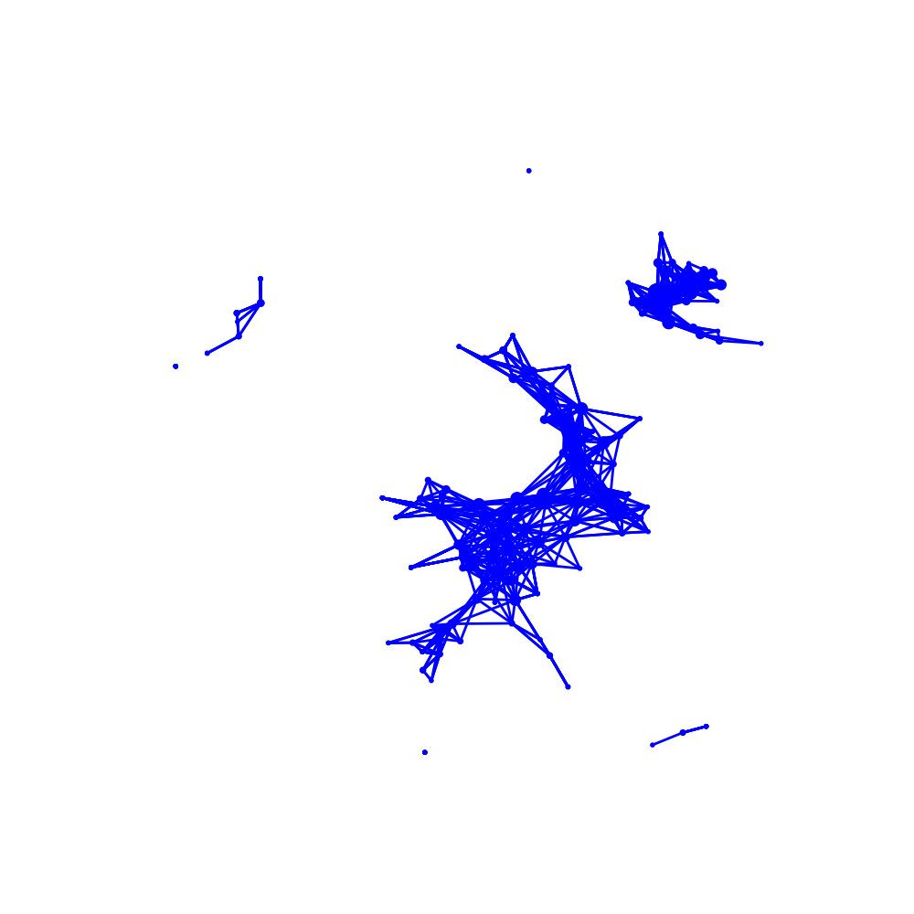
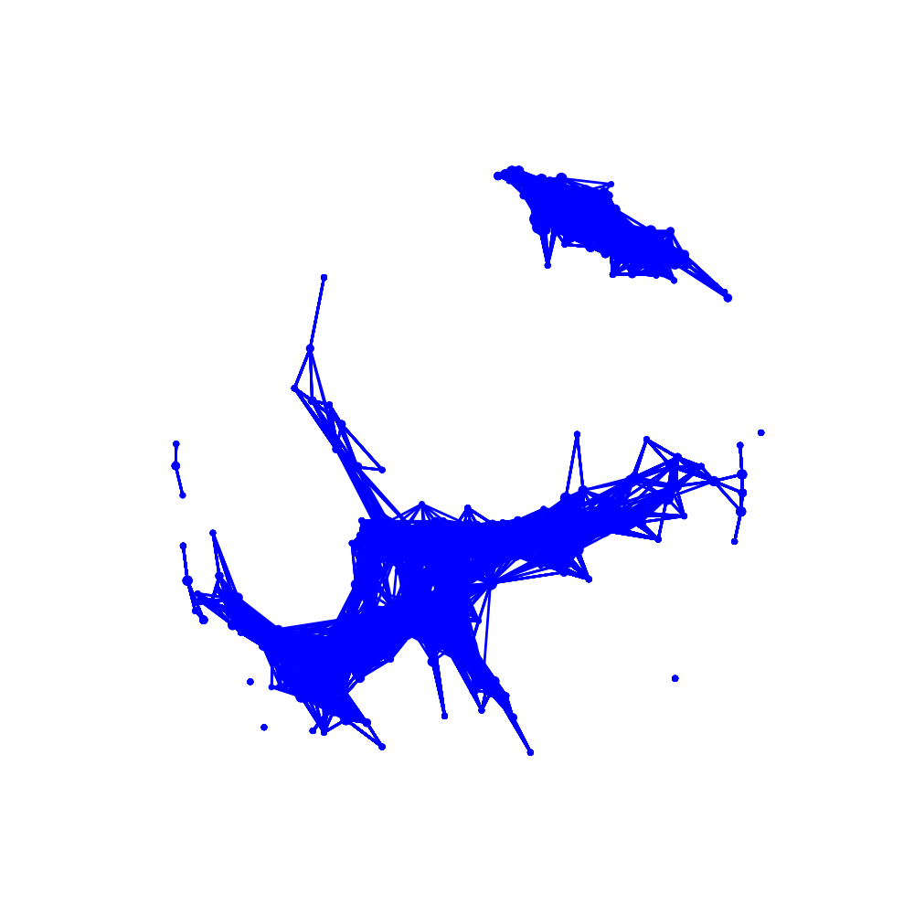
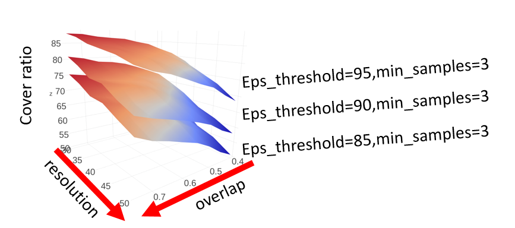

# How to Choose Parameters in *tmap*

*tmap* consists of several steps of data analysis, from projection to TDA network construction. The choice of different parameters for each step influences the final TDA network. Given different dataset and the underlying study questions, these parameters should be set up carefully. We will demonstrate how these parameters would affect the final result and how to choose them properly in this tutorial.

## Selecting `components` in `filter`

Projection of original data points onto a low dimensional representation is the first step of *tmap*, and it is important to set up the `filter` and `components` properly. If we go to the details of the algorithm in [how *tmap* work](how2work/#how-tmap-work), we can see that increasing the number of components of a filter will exponentially increase the time of computation and also the number of edges/nodes.
Usually, different filters, such as PCA and t-SNE, project the data in different ways, and will give different TDA results. In our experience, we can try different filters (PCA, MDS, t-SNE), and choose the suitable one, and most of the time, we use two components for each filter.

In the following code, we compare the effects of choosing different components for *tmap* analysis, using the iris dataset.

```python3
from sklearn.preprocessing import MinMaxScaler, StandardScaler
from sklearn import datasets
from sklearn.cluster import DBSCAN
from tmap.tda import mapper, filter
from tmap.tda.cover import Cover
from tmap.tda.plot import show, Color


iris = datasets.load_iris()
X = iris.data
y = iris.target

# Step1. initiate a Mapper
tm = mapper.Mapper(verbose=1)

# Step2. Projection
lens = [filter.MDS(components=[0, 1],random_state=100)]
projected_X = tm.filter(X, lens=lens)

# Step3. Covering, clustering & mapping
clusterer = DBSCAN(eps=0.75, min_samples=1)
cover = Cover(projected_data=MinMaxScaler().fit_transform(projected_X), resolution=20, overlap=0.75)
graph = tm.map(data=StandardScaler().fit_transform(X), cover=cover, clusterer=clusterer)

show(data=X,graph=graph, color='b', fig_size=(10, 10), node_size=15, mode='spring', strength=0.03)
```

```
Filtering by MDS.
...calculate distance matrix using the euclidean metric.
Finish filtering of points cloud data.
Mapping on data (150, 4) using lens (150, 2)
...minimal number of points in hypercube to do clustering: 1
...create 219 nodes.
...calculate projection coordinates of nodes.
...construct a TDA graph.
...create 1133 edges.
Finish TDA mapping
```


Using two components of MDS as *lens*, *tmap* generates a graph with 219 nodes and 1133 edges.
*Note: component index is 0-based, and the first component is indexed by 0*.

What if we choose three components of MDS?

```python3
from sklearn.preprocessing import MinMaxScaler, StandardScaler
from sklearn import datasets
from sklearn.cluster import DBSCAN
from tmap.tda import mapper, filter
from tmap.tda.cover import Cover
from tmap.tda.plot import show

iris = datasets.load_iris()
X = iris.data
y = iris.target

# Step1. initiate a Mapper
tm = mapper.Mapper(verbose=1)

# Step2. Projection
lens = [filter.MDS(components=[0, 1, 2],random_state=100)]
projected_X = tm.filter(X, lens=lens)

# Step3. Covering, clustering & mapping
clusterer = DBSCAN(eps=0.75, min_samples=1)
cover = Cover(projected_data=MinMaxScaler().fit_transform(projected_X), resolution=20, overlap=0.75)
graph = tm.map(data=StandardScaler().fit_transform(X), cover=cover, clusterer=clusterer)

show(data=X,graph=graph, color='b', fig_size=(10, 10), node_size=15, mode='spring', strength=0.17)
```

```
Filtering by MDS.
...calculate distance matrix using the euclidean metric.
Finish filtering of points cloud data.
Mapping on data (150, 4) using lens (150, 3)
...minimal number of points in hypercube to do clustering: 1
...create 921 nodes.
...calculate projection coordinates of nodes.
...construct a TDA graph.
...create 13279 edges.
Finish TDA mapping
```



The resulted graph has 921 nodes and 13279 edges. Increasing number of components makes the graph more densely connected with more nodes. If we compare these two graphs visually, we could see that the general topological structure is similar. But the more `components` you used, the more complicated a graph will be generated. We recommend the default parameter `components=[0,1]` in most situations.

## Selecting `resolution` and `overlap` in `Cover`

The `Cover` class of *tmap* controls the resolution we want to study the underlying 'data shape', together with strength of continuity we want to keep on that 'shape'. There are two parameters for this purpose: `resolution` decides how many intervals/bins you want to split the data into along each filter components, and `overlap` specifies the fraction of adjacent intervals need to be overlapped.

The `resolution` parameter determines the number of hypercubes to calculate: `resolution ** n_components`. Although increasing `resolution` can help to retain a fine-grain structure of the underlying 'data shape', it should be balanced with the number of samples in the analyzed dataset. Setting a `resolution` parameter too high will result in a 'sparse' TDA network, with many samples unclustered or ignored. In principle, if the dataset are densely sampled from a 'hidden data shape', higher `resolution` is better. Otherwise, `resolution` should be set up to have enough samples in each hypercube for downstream clustering analysis.


To demonstrate the effects, we increase `resolution` by 10 times and leave `overlap` unchanged. As shown above, high `resolution` for a small dataset will cause each hypercube has too few samples for clustering and no significant clusters can be detected. The resulting network will become sparse and fragmented. But using a very low `resolution` will generate a TDA graph too coarse to capture the true underlying 'data shape'.

The `overlap` parameter influences the edges between nodes in a TDA network. The larger the `overlap` you set, the more edges you will have between nodes, and therefore, a denser TDA network will be reconstructed. Too low `overlap` will eliminate most of the edges, and will result in many isolated nodes or network components.


As we see above, `resolution` is an empirical parameter, which is depend on the size of your dataset. It should be carefully adjusted to reconstruct the underlying data shape properly. The larger the `overlap` you use, the more 'continuity' it will capture. Apart from the effects on general structure of a TDA network, these parameters also influence **cover ratio** of samples to be retained by clustering analysis, which will be discussed below.

## Selecting `eps` and `min_samples` in DBSCAN

*tmap* uses DBSCAN as the default cluster, which is a density-based clustering method, and has two primary parameters: `eps` and `min_samples`. `eps` is the maximum distance between two samples for them to be considered as in the same neighborhood during clustering; and `min_samples` specifies how many neighbors a point should have to be considered as a 'core point' for cluster formation. These two parameters have great impacts on how many samples can be clustered into nodes, and how many samples will be shared between nodes to connect them with edges.

To aid in selecting a proper value of `eps`, we implemented `utils.optimize_dbscan_eps`, which can automatically determine the parameter from an input dataset. This function tries to estimate the distribution of neighborhoods from a dataset by calculating the distance to its nearest neighbor for each sample. Based on this distribution of nearest-neighbor distances, we can select a desired `eps` value for which we can cover/cluster the neighborhood for a specified **percentage** of samples, by passing a `threshold` (percentile value) to `optimize_dbscan_eps`.

For the `min_samples` parameter, we may want to retain minor clusters using a small value, such as `min_samples=2`, or use a large value to keep large and robust clusters only. If we set `min_samples` too large, we will only be able to see a 'backbone' of the 'data shape', and lose many samples that are scattered around. Therefore, large `min_samples` is suitable for ***big*** dataset to capture its 'backbone' structure. But for small dataset, a small value will be more proper.

## Optimization of a *cover ratio* of Samples

During the clustering process in *tmap*, unclustered samples will be discarded and not included in the final TDA network. Here we designate a *cover ratio* as a measure of how many samples (as percentage) are retained in a final *tmap* network. Cover ratio is influenced directly by the parameters of `resolution`, `overlap`, `eps` and `min_samples`. In practice, it may be unaffordable to lose too many samples, and we want to have a large cover ratio. Here we explore the relationship between *cover ratio* and some of the *tmap* parameters using a real FGFP microbiome dataset (see the ['Microbiome Examples'](example.md) for more details about this dataset).

### Relationship between *cover ratio* and *tmap* parameters

The following figure shows how *cover ratio* changes along with different *tmap* parameters.


We summarize the effects of different parameters on *cover ratio* as in the following table, which can be used as a guidance for tuning parameters manually:

| parameter | relationship / effects |
| --- | --- |
| `eps` |	larger value increases cover ratio |
| `overlap` | larger value increases cover ratio |
| `resolution` | larger value decreases cover ratio |
| `min_samples` | larger value decreases cover ratio |
