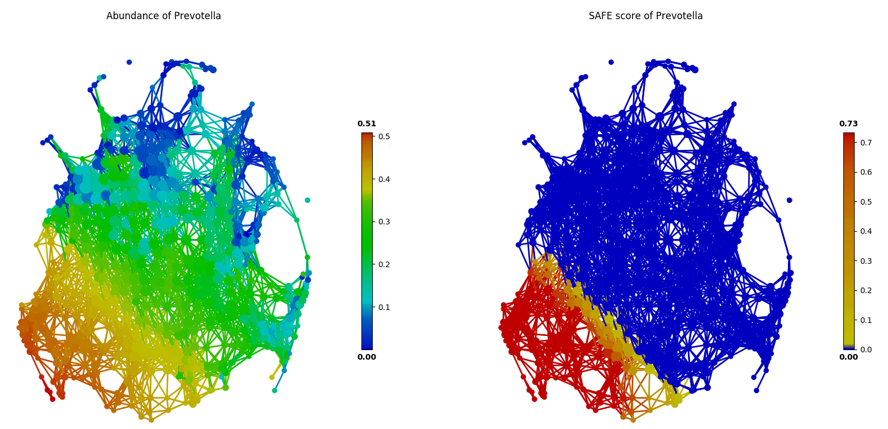

# Network Statistical Analysis in *tmap*

## Network-based Enrichment Analysis

We have implemented the Spatial Analysis of Functional Enrichment (SAFE) algorithm in *tmap* for network enrichment analysis. This algorithm assigns a SAFE score to each node. In brief, if a target variable is highly enriched (of higher values) around a group of nodes in a network, its statistical significance can be calculated by taking the network structure into account. In *tmap*, SAFE score is a log10-transformed and normalized p-value for each node. With such a enrichment score in hand, we can color the network using SAFE scores of a target variable, instead of its original values. More details on the SAFE algorithm and SAFE score can be found at ['How *tmap* work'](how2work.md).

The following codes show how SAFE scores help to identify enriched nodes with significantly higher target values. In this case of FGFP microbiome study, a driver species (*Bacteroides*) enriched a group of connected nodes (the upper part of the network), which is more evident than a plotting with original species abundance values.

```python
from __future__ import print_function
import os
from sklearn.preprocessing import MinMaxScaler
from sklearn.cluster import DBSCAN
from tmap.tda import mapper, filter
from tmap.tda.cover import Cover
from tmap.tda.plot import show, Color
from tmap.tda.metric import Metric
from tmap.tda.utils import optimize_dbscan_eps,cover_ratio
from tmap.netx.SAFE import SAFE_batch
from tmap.test import load_data


# load taxa abundance data, sample metadata and precomputed distance matrix
X = load_data.FGFP_genus_profile()
metadata = load_data.FGFP_metadata()
dm = load_data.FGFP_BC_dist()

# TDA Step1. initiate a Mapper
tm = mapper.Mapper(verbose=1)

# TDA Step2. Projection
metric = Metric(metric="precomputed")
lens = [filter.MDS(components=[0, 1], metric=metric,random_state=100)]
projected_X = tm.filter(dm, lens=lens)

# Step4. Covering, clustering & mapping
eps = optimize_dbscan_eps(X, threshold=95)
clusterer = DBSCAN(eps=eps, min_samples=3)
cover = Cover(projected_data=MinMaxScaler().fit_transform(projected_X), resolution=50, overlap=0.75)
graph = tm.map(data=X, cover=cover, clusterer=clusterer)
print('Graph covers %.2f percentage of samples.' % cover_ratio(graph,X))

## Step 6. SAFE test for every features.
target_feature = 'Bacteroides'
n_iter = 1000
safe_scores = SAFE_batch(graph, meta_data=X, n_iter=n_iter, threshold=0.05)

def visu_temp(target_feature,dtype='numerical',strength=0.04):
    color = Color(target=X.loc[:, target_feature], dtype=dtype, target_by="sample")
    show(data=X, graph=graph, color=color, fig_size=(10, 10), node_size=15, mode='spring', strength=strength)
    title('Abundance of ' + target_feature)
    color = Color(target=safe_scores[target_feature], dtype=dtype, target_by="node")
    show(data=X, graph=graph, color=color, fig_size=(10, 10), node_size=15, mode='spring', strength=strength)
    title('SAFE score of ' +target_feature)

visu_temp(target_feature,dtype='numerical',strength=0.08)
```


## Network-based Co-enrichment Analysis

Co-occurrence of microbial species can be used to infer relationship between species in a community. The concept of species co-occurrence is extended in *tmap* to a network-based co-enrichment analysis, which is a statistical analysis of species relationships based the TDA network structure.

For example, using the FGFP microbiome dataset, we can test and visualize co-enrichment between identified driver species. As shown in the following figure,  *unclassified_Clostridiaceae* and *Methanobrevibacter* are highly co-enriched in the network, which is more evident by SAFE scores than original species abundance.


Mutually exclusive relationship between driver species can also be identified via this approach of network statistical analysis, based the SAFE scores rather than abundance. In the following figure, two known enterotype driver species, *Prevotella* and *Bacteroides*, are shown to have a mutually exclusive relationship in the FGFP microbiome dataset.




## Network-based Association Analysis

*tmap* calculates SAFE scores for each node, given a target variable. We have implemented the `SAFE_batch` function in *tmap* for batch calculation for many target variables at the same time. For target variables, they can be either species abundance or sample metadata. In this way, *tmap* provides two transformations on the input data. First, it transforms raw values to SAFE scores for a target variable. Meanwhile, it transforms samples into nodes, which are aggregations of a group of samples.

Therefore, we can perform a network-based association analysis for any pair of target variables, using SAFE scores on nodes. To do this, the output of SAFE scores for target variables can be used as input data to any association analysis method, such Pearson's association analysis. In our analysis of the FGFP microbiome dataset, this network-based association analysis can detect 'species-metdata' associations with improved statistical power and effect size, compared to other methods.
